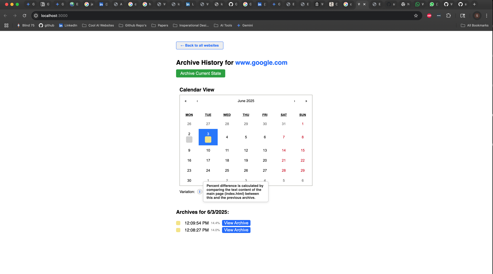

# Website Archiving Tool

## Overview

This project is an end-to-end web archiving tool inspired by the Wayback Machine. It allows users to archive websites, including all linked pages and assets, and view historical snapshots with change visualization. The system is built with a React frontend and a Node.js backend, using file-based storage for simplicity.

---

## Features

- **Archive any website**: Enter a URL to archive the page and all linked pages on the same domain, including images, CSS, and scripts.
- **Versioning**: Each archive is timestamped. You can re-archive a site at any time to capture updates.
- **Snapshot browsing**: View a calendar of all archives for a domain. Click a date to see all snapshots for that day.
- **Change visualization**: Calendar days are color-coded by how much the site changed (gray/yellow/green/blue for no/low/medium/high change). See percent difference for each snapshot.
- **Serve archived content**: Snapshots are fully browsable and include all necessary assets.

---

## Architecture

- **Frontend**: React (see [`frontend/README.md`](frontend/README.md))
- **Backend**: Node.js/Express (see [`backend/README.md`](backend/README.md))
- **Storage**: File-based, under `backend/archives/`

---

## Project Structure

```
WebsiteArchiving/
├── backend/           # Node.js/Express backend
│   ├── archives/      # All archived website data (by domain/timestamp)
│   ├── src/           # Backend source code (controllers, routes, services, utils)
│   ├── package.json   # Backend dependencies and scripts
│   └── README.md      # Backend setup and API docs
│
├── frontend/          # React frontend
│   ├── public/        # Static assets and HTML
│   ├── src/           # Frontend source code (App.js, styles, etc.)
│   ├── package.json   # Frontend dependencies and scripts
│   └── README.md      # Frontend setup and usage docs
│
├── README.md          # Top-level project overview and setup (this file)
└── writeup.md         # Project write-up: decisions, trade-offs, scaling ideas
```

---

## How the Frontend and Backend Communicate

The frontend (React app) and backend (Node.js/Express) communicate via HTTP requests. The frontend sends requests to archive, list, and view websites. The backend processes these requests, manages the archives, and sends data or files back to the frontend.

```
[User's Browser: React Frontend]
        |
        |  (HTTP requests: fetch, archive, list, etc.)
        v
[Node.js/Express Backend API]
        |
        |  (Reads/writes files, fetches websites)
        v
[File Storage: backend/archives/]
```

- The frontend sends HTTP requests to the backend to archive, list, and view websites.
- The backend processes these requests, manages the archives, and serves data or files back to the frontend.

---

## Quick Start

### 1. Clone the Repository

```bash
git clone https://github.com/yourusername/WebsiteArchiving.git
cd WebsiteArchiving
```

### 2. Start the Backend

```bash
cd backend
npm install
npm start
```
- The backend will run on [http://localhost:3001](http://localhost:3001) by default.
- See [`backend/README.md`](backend/README.md) for API details and more.

### 3. Start the Frontend

Open a new terminal window/tab:

```bash
cd frontend
npm install
npm start
```
- The frontend will run on [http://localhost:3000](http://localhost:3000) by default.
- See [`frontend/README.md`](frontend/README.md) for more info.

---

## Usage

1. Open the frontend in your browser.
2. Enter a website URL and click "Archive".
3. Select a domain to view its archive history.
4. Use the calendar to explore snapshots and see how the site changed over time.
5. Click a timestamp to view the archived site as it appeared at that time.

---

## Technical Requirements 
- **Frontend**: React
- **Backend**: Node.js/Express
- **Data Storage**: File-based (no database required)

---

## Enhancements & Creative Features

- Color-coded calendar for visualizing changes
- Percent difference calculation between snapshots
- Multiple archives per day supported
- Clean, modern UI

---
## Visual Tour: Key Features in Action

*Archives that exsist are shown in alphabetical order you can also search them*


*Once you click on a specific archive this is the webpage that opens up.*


*Comparing changes between two snapshots and what happens when you click on a date.*

---

## More Information

- For backend API and implementation details, see [`backend/README.md`](backend/README.md)
- For frontend usage and customization, see [`frontend/README.md`](frontend/README.md)

---

## License

MIT
